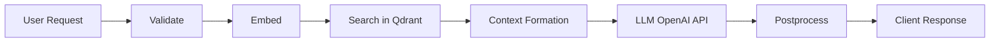

# MCP — Multi-Component Pipeline

**MCP** (Multi-Component Pipeline) is a modular framework for building request processing chains using **LLM**, **Retrieval-Augmented Generation (RAG)**, and vector search (**Qdrant**).  
Each pipeline step is executed sequentially and can be replaced or extended.

---

## ✨ Features

- **LLM Orchestration** — step-by-step request processing with logging
- **RAG** — context retrieval through Qdrant
- **Streaming API** — LLM response streaming support
- **Modular Architecture** — each step is implemented as a separate module
- **Integration Ready** — REST API compatible

---

## 🚀 Quick Start

### 1. Clone the repository
```bash
git clone https://github.com/YOUR_USERNAME/mcp.git
cd mcp
```

### 2. Run with Docker Compose
```bash
docker compose up --build
```

### 3. Make a request
```bash
curl -X POST http://localhost:3001/pipeline/run \
  -H "Content-Type: application/json" \
  -d '{"query":"What is the Multi-Component Pipeline?"}'
```

**Example response:**
```json
{
  "result": "MCP is a graph-based system that utilizes Qdrant for managing and processing its components..."
}
```

---

## 📁 Project Structure

```
apps/
  api/          # API service with /pipeline/run and /pipeline/stream endpoints
  web/          # Next.js UI (if used)
infra/          # docker-compose, service configs
pipeline/       # pipeline steps
  steps/
    validate.js
    embed.js
    search.js
    llm.js
    postprocess.js
```

---

## 🛠️ Tech Stack

- **Node.js** — backend runtime
- **Qdrant** — Vector Database
- **OpenAI API** — LLM provider
- **Docker & Docker Compose** — containerization

---

## 📊 Pipeline Architecture



---

## 🔧 Configuration

### Environment Variables
```bash
# .env
OPENAI_API_KEY=your_openai_api_key
QDRANT_URL=http://localhost:6333
QDRANT_API_KEY=your_qdrant_api_key
PORT=3001
```

### Docker Compose
```yaml
# docker-compose.yml
version: '3.8'
services:
  api:
    build: ./apps/api
    ports:
      - "3001:3001"
    environment:
      - OPENAI_API_KEY=${OPENAI_API_KEY}
      - QDRANT_URL=http://qdrant:6333
    depends_on:
      - qdrant

  qdrant:
    image: qdrant/qdrant:latest
    ports:
      - "6333:6333"
    volumes:
      - qdrant_data:/qdrant/storage

volumes:
  qdrant_data:
```

---

## 📡 API Endpoints

### POST /pipeline/run
Executes the full request processing pipeline.

**Request:**
```json
{
  "query": "What is machine learning?",
  "options": {
    "stream": false,
    "max_results": 5
  }
}
```

**Response:**
```json
{
  "result": "Machine learning is a subset of artificial intelligence...",
  "metadata": {
    "processing_time": 1250,
    "steps_executed": ["validate", "embed", "search", "llm", "postprocess"],
    "context_sources": 3
  }
}
```

### POST /pipeline/stream
Same functionality but with streaming response.

**Request:**
```json
{
  "query": "Explain neural networks",
  "stream": true
}
```

**Response:** Server-Sent Events (SSE)

---

## 🔌 Extending the Pipeline

### Adding a New Step

1. Create a file in `pipeline/steps/`:
```javascript
// pipeline/steps/custom-step.js
export async function customStep(context) {
  const { query, previousResults } = context;
  
  // Your processing logic
  const result = await processData(query);
  
  return {
    ...context,
    customResult: result
  };
}
```

2. Register the step in the pipeline:
```javascript
// pipeline/index.js
import { customStep } from './steps/custom-step.js';

export const pipeline = [
  validateStep,
  embedStep,
  searchStep,
  customStep,      // ← new step
  llmStep,
  postprocessStep
];
```

---

## 🧪 Testing

### Running Tests
```bash
npm test
```

### Integration Tests
```bash
npm run test:integration
```

### Load Testing
```bash
npm run test:load
```

---

## 📊 Monitoring

### Logs
```bash
# View API logs
docker compose logs -f api

# Qdrant logs
docker compose logs -f qdrant
```

### Metrics
- Processing time per step
- Requests per second
- Vector DB memory usage
- LLM request latency

---

## 🤝 Contributing

1. Fork the repository
2. Create a feature branch: `git checkout -b feature/amazing-feature`
3. Commit your changes: `git commit -m 'Add amazing feature'`
4. Push to the branch: `git push origin feature/amazing-feature`
5. Create a Pull Request

---

## 📄 License

MIT License - see [LICENSE](LICENSE) file for details